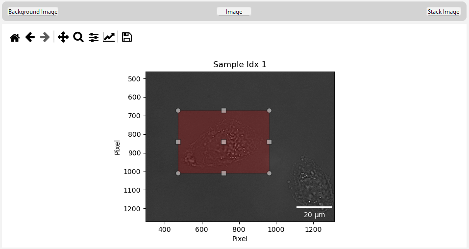

Cell Selection
==================

*This step explains how to select a cell for further calculations.*

*(The current step is shown in the top right corner of the main window)*

*************************************************************************

.. warning::
    Selecting the cell as accurately as possible is critical for correct calculations. This step is highly sensitive and must be done carefully.

.. note::
    The displayed image in this view is intentionally **not** in focus. This helps make the cells more visible. However, the software uses 
    the **in-focus** version of the image for all calculations.

Available views
~~~~~~~~~~~~~~~~~~~~~~~~

You can choose between three different views to help with cell selection:

- ``Background Image:`` Displays **only** the background
- ``Image:`` Displays the original sample image
- ``Stack Image:`` Displays the sample image divided through the background image

The ``Stack Image`` is particularly helpful to check for any artifacts that might affect the stack calculation later on.

*******************************************************************************************************************************

Selecting the Cell
~~~~~~~~~~~~~~~~~~~~~~~~~~~~~~~

To properly select the cell (and optionally crop the image for better visibility during calculations), you must manually draw a selection:
 1. Click on the image to start drawing
 2. Drag the mouse to create a rectangle around the target cell
 3. Release the mouse button to finalize the selection

Ensure that:

- The selected red square encloses only the target cell as precisely as possible.
- Avoid including other cells or artifacts near the edges of the rectangle.
- No other cell should appear in the background of the selected area.

Using the ``Stack Image`` view can help verify that the selected region is clean and suitable for further processing.

To delete or re-draw the selection, simply click outside the current red box and draw a new area.

.. note::
    Changing the view will automatically remove the current selection. 