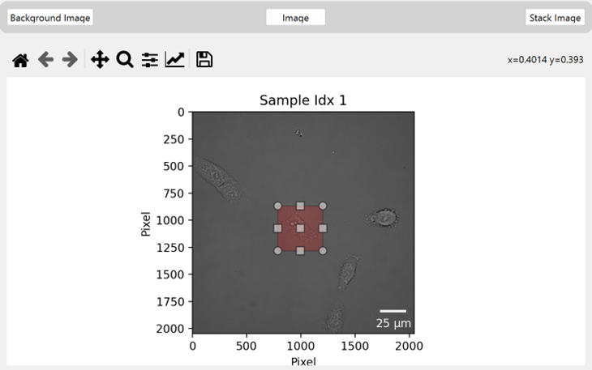

Cell Selection
==================

In this step, it gets described how a cell can be select for further calculations.

(The here ongoing process is shown in the top right corner of the main window)

*************************************************************************

.. warning::
    For further calculations, selecting the cell as closely as possible is important. This step is very sensitive to the calculations 
    and has to be done carefully.

.. note::
    In this view a not in focus image is displayed. This is done to make the cells more visible. The software uses the in focus 
    image for the calculations.

Three different views can be selected:

- **Background Image:** Background
- **Image:** Sample Image
- **Stack Image:**  Sample image divided through the background image

A usefull view is the **Stack Image**, where it can be controlled if the satack calculation (wich is later used) has no 
initial artifacts.

*******************************************************************************************************************************

Click on the image to display a red square, shown in Figure~\ref{fig:cell-selection}. This square must be used to select the cell
as precisely as possible. There must be no other cells or artifacts at the edges of the red square. Otherwise, the phase reconstruction 
will not work. Ensure there is also no cell in the background within the selected part. The stack view is useful for this.

To delete the selected part or draw a new one, click out of the red box and draw a new area.

If you change the view, the selected part is deleted.

