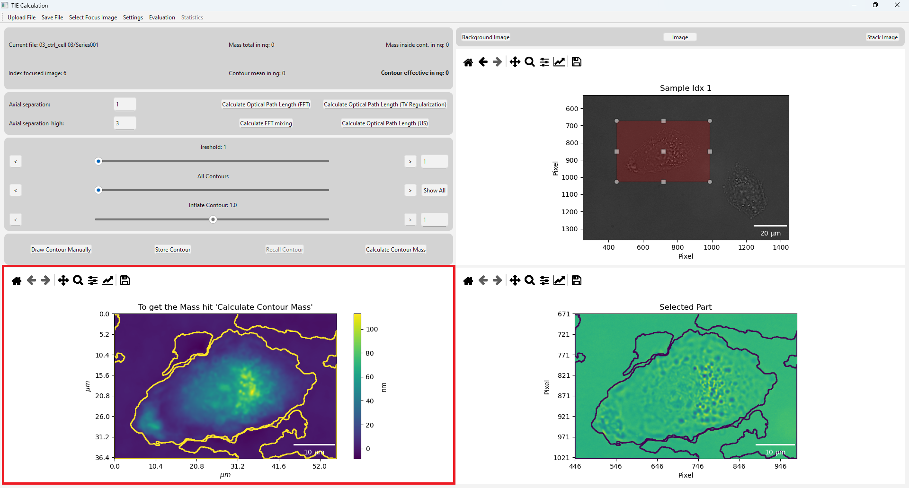
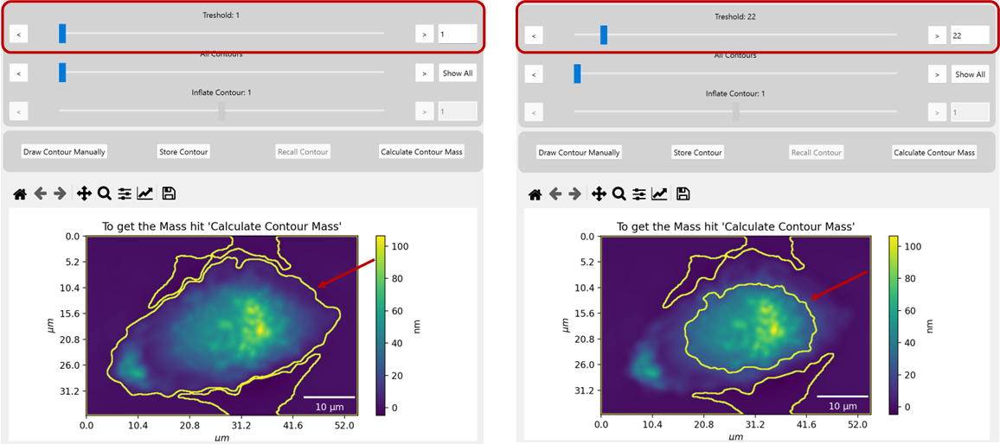
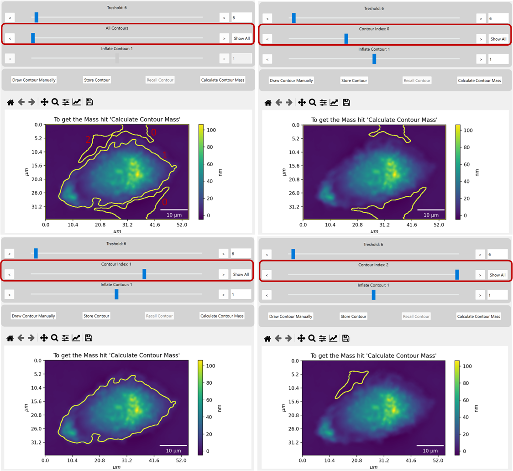
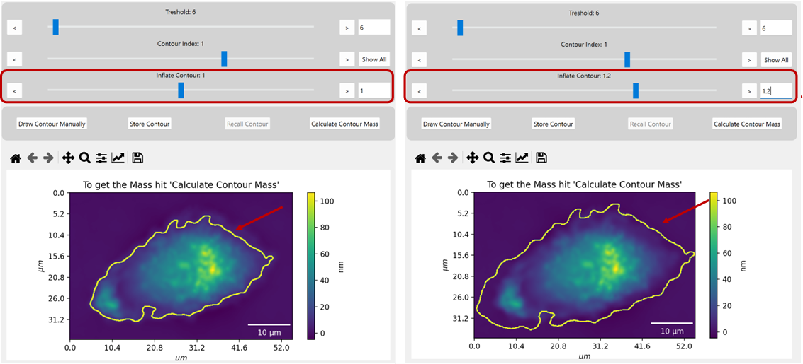
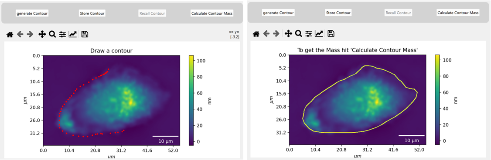
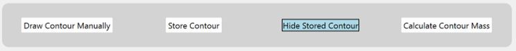

.. _contour_detection:

Contour Detection
==================

*Contour detection is a method used to identify the outline of a cell. This is crucial for calculating the dry mass, 
as the dry mass is computed only within the contour.* 

******************************************************************************************************************************

.. note::
    Contour detection is available only if the :ref:mass_calculation has been completed correctly. 
    The contour detection buttons and slider will remain disabled until a valid mass calculation has been made.

Contour Selection Options:
~~~~~~~~~~~~~~~~~~~~~~~~~~~~~~~~

- :ref:`ref_Generate_Contour` - The contour is generated automatically based on the image data.
- :ref:`ref_Draw_Contour_Manually` - The contour is drawn manually by the user.
- :ref:`ref_Store_Contour` - The contour is saved for later use.

The mass of the contour displayed in the plot is calculated by pressing the ``Calculate contour mass`` button.
This process is the same for all contour detection options.

.. _ref_Generate_Contour:

Generate Contour
~~~~~~~~~~~~~~~~~~~~~~

The initial contour detection occurs automatically when the mass calculation is executed correctly. 
The contours are shown as yellow lines in the graphic, and initially, all possible contours are displayed. In addition to 
this view, in the bottom right cornern of the image, the contours are drawn in the raw image. This provides an easier
and more intuitive way to select the correct contour.

In the next step, it's important to adjust the parameters for contour detection to ensure that one of the displayed contours perfectly
matches the cell. Be careful not to get confused from other contours that aren't relevant to the cell, because initially, 
all contours are displayed.

The parameter ``Threshold`` the sensitivity of contour detection. 
Increasing the threshold means that only large intensity gaps will be detected, 
while lowering it makes the contour detection more sensitive to smaller intensity variations.
    

Once the correct threshold is set, the contour can be selected using the ``Contours`` slider. 
Moving the slider all the way to the left will display all contours. As you move the slider to the right, 
the contours are displayed individually. A single contour must be selected for the next calculation steps.
(In the first image, the detected contours area numbered in red, this is just for visualization and not part of the GUI.)

If the contour found does not cover the entire cell, the contour can be inflated or deflated, to adjust the size.

Once you have found a matching contour, you can select the contour and calculate the mass within the contour by
clicking on the ``Calculate Contour Mass`` button.

.. _ref_Draw_Contour_Manually:

Draw Contour Manually
~~~~~~~~~~~~~~~~~~~~~~~~~~~~~~~

If no contour can be found with the prevoiusly set parameter, , you can manually draw the contour by clicking the 
``Draw contour manually`` button. This will hide the automatically generated contours. By clicking with the right mouse button on the image, 
points can be drawn which form later the contour. 
To draw the contour, right-click on the image to place points that will form the contour. When you release the mouse button, 
the shape is drawn. 
Once you're satisfied with the contour, click the "Calculate Contour Mass" button to calculate the mass within the contour.

.. note::
    To delete the manually drawn contour, click on the image again and start drawing a new one.

Hitting the ``Generate contour`` button will exit the manual contour drawing mode.

.. _ref_Store_Contour:

Store Contour
~~~~~~~~~~~~~~~~~~~~~~~~~~~~~~~

If you need to use the same contour for multiple calculations, you can store it. 
The stored contour remains until a new file is uploaded.

To save a contour, click the ``Save Contour`` button, and the currently displayed contour will be stored.
To retrieve the stored contour, press the ``Retrieve Contour`` button. When the stored contour is displayed, 
the button changes to **"Hide Saved Contour"** and is highlighted in blue.

.. note::
    Only one contour can be stored at a time. If you save a new contour, the previous one will be overwritten.

