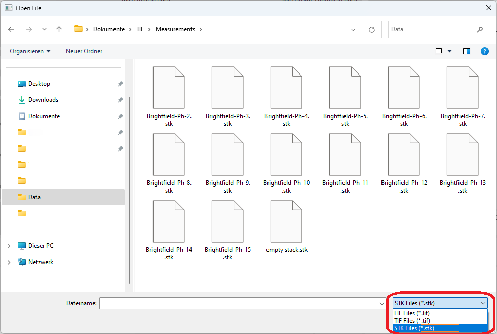

Uploading Files
=================

*The following section describes how to upload files to the software.*

*********************************************************************

You can upload the following file types to the software:

- Tagged Image File Format (``.tiff``)
- Leica Image File Format (``.lif``)
- Stack Image File Format (``.stk``)

To upload one of these files, click the ``Upload file`` button in the toolbar, which will open the following dialog: 

At the bottom right corner, you need to choose a filter for the file type you want to upload. 
When the upload is successful, you will be redirected to the :ref:`ref_settings` page.

.. warning::
    If you **can not see the desired file** in the file dialog, check the filter at the bottom right corner of the upload dialog.
    If this fileter is set wrong, the file will not be visible in the file dialog. 

