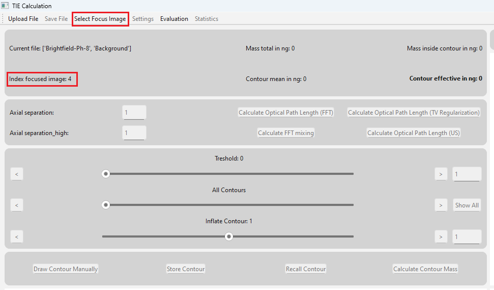
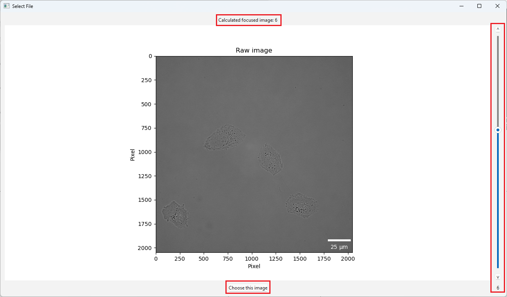

Selecting Focused Image
=========================

Here the selection of the focused image is described. 

************************************************************

Once the files have been uploaded successfully, the index of the focused image is calculated automatically. This index is displayed in the ``mainwindow``
as shown in the figure below (highlighted in red).  To verify whether the calculated index is correct, click the 
``Select Focus Image`` button in the toolbar.

**********************************************************

When the button ``Select Focus Image`` in the toolbar is clicked, a new window with the title ``Select Focused Image`` opens.
In this window, the user can scroll through the image stack using the slider to visually determine the focused image. 
The automatically calculated index is shown in the top center.

To set a specific image as the focused one, select it and then click the ``Choose this Image`` button.

