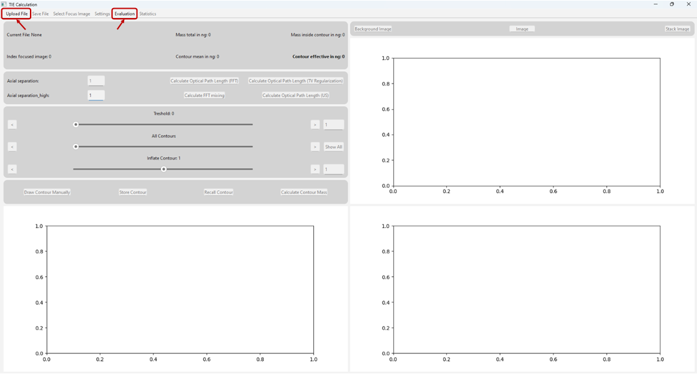

TIE Programm Manual
==========================

This software provides a simple and efficient tool for analyzing images of cells, specifically designed to determine both the dry mass 
and the area of a single cell. It utilizes the **Transport of Intensity Equation (TIE)**, which requires only a stack of images captured 
with a widefield microscope.

To ensure accurate analysis, the software processes image stacks along the z-axis — the optical axis of the microscope. These stacks 
must contain at least three images of the same cell taken at different z positions, with the middle image ideally being in focus. 
The software supports multiple image formats, including

- ``Tagged Image File Format (.tiff)``
- ``Leica Image File Format (.lif)``
- ``Stack Image File Format (.stk)``
  
allowing flexibility in sourcing images from various microscopes or imaging devices.

Two computational approaches are implemented to solve the TIE:

- Fast Fourier Transform (FFT)
- Total Variation (TV) Regularization

Additionally, a :ref:`contour_detection` feature is included to accurately calculate the cell area.

In summary, this tool provides a robust framework for extracting key quantitative data from cell images, making it possible to 
analyze both the dry mass and area of cells from microscopy image stacks.

************************************************************************************************************************************

This software is designed to ensure that calculations proceed only when **all steps are completed in the correct sequence**. 
Buttons that can not be used are disabled (-> grayed out), indicating that a required step in the sequence is missing. 

   Here the marked buttons are enabled and only those can be used. The other buttons are grayed out and can not be used. 

To proceed, follow the steps outlined in this manual, which are roughly summarized already in the table of contents.

The software consists of the following four main parts:

1. Uploading a file and setting the parameters
2. Selecting the cell as precisely as possible
3. Calculating the optical path delay (OPD)
4. Adjusting the contour to calculate the area of the cell

Additionally, the software provides tools to adjust all generated plots and images using a built-in toolbar.
For more details, refer to the `official page of the matplotlib library <https://matplotlib.org/3.2.2/users/navigation_toolbar.html>`_.

   .. toctree::
      :maxdepth: 4
      :caption: Manual

      introduction
      installation
      file_upload
      settings
      focused_image
      cell_selection
      mass_calculation
      contour_detection
      saving
      evaluation
      statistics