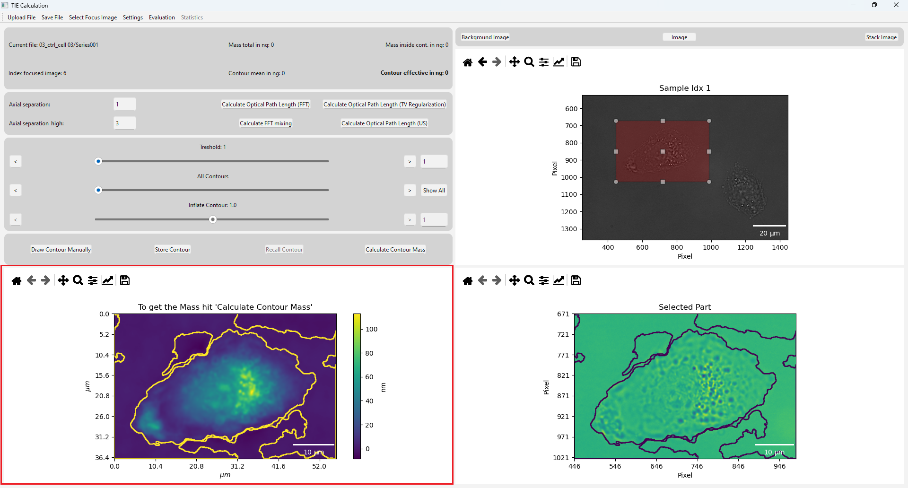

.. _mass_calculation:

Dry Mass Calculation
=========================

*This chapter explains how to calculate the dry mass of a cell. 
There are different methods available for this calculation, which are described in the following sections.*

*************************************************************************************************************

.. note::
    The dry mass calculation is only available if the :ref:`cell_selection` has been made correctly. 
    If no cell is selected, the calculation cannot be performed.
    The buttons for the calculation will be disabled until a valid selection is made.

The calculation in this step evaluates the optical path length (opd) of the selected region selected prevoiusly. From the opd, 
the dry mass can be calculated. The result is shown in the bottom left corner. 
When executing the calculation, in the whole selected region the calculation gets executed. The result of this calculation is 
displayed in the bottom left corner of the window.

For the calculation there are implemented various methods:

- :ref:`ref_FFT`
- :ref:`ref_TV`
- Other??

.. warning::
   For both calculation methods, it is important that there are no cells or other artifacts 
   (dust, noise, air bubbles, etc.) at the boundaries of the selected area.

.. error::
    ATTENTION:
    Here are now more possibilities for the calculation.

.. _ref_FFT:

FFT (Fast Fourier Transform)
~~~~~~~~~~~~~~~~~~~~~~~~~~~~~~~~~~~~~~~~~~~~~~~~~~

It is important to enter an axis distance for the calculation. This parameter is used to define the axial distance for the derivative 
calculation. The axial distance can only be selected so that the stack is not exceeded during addition with the focused image and cannot 
be less than 0 during subtraction. A larger axial distance leads to a blurred effect in the reconstruction. In order to obtain the best 
possible solution, a small axial distance should be tried. If the image is noisy or the reconstruction does not work properly, the axial 
separation can be set to larger distances, which results in less influence of the noise on the reconstruction.

The axial distance can be entered as an index and refers to the distance between the indices in the stack.
After setting the axial distance, the optical path length can be calculated by clicking the ``Calculate Optical Path Length (FFT)`` button.
If the axial distance is within the range, the optical path delay is calculated and displayed in the lower left-hand graphic.

.. _ref_TV:

TV Regularization
~~~~~~~~~~~~~~~~~~~~~~~~~~~~~~~~~~~~~~~~~~~~~~~~~~

For the calculation with TV regularization, it is important to set the parameter in the Settings Window~\ref{sec:settingWindow} 
(the entry for the axial separation has no influence on this method).

This method is useful if the reconstruction with the FFT method~\ref{subsec:FFT} does not work. It is better suited to processing noisy images. 
The penalty factor is crucial here. Penalty factors that are too large lead to a flattening effect, which results in a falsification of 
the dry mass. This factor is a compromise between flattening the cell mass and poor reconstruction. The best choice must be tried out manually. Iterations can also be set in the Settings Window~\ref{sec:settingWindow}, high iterations take a lot of time to reconstruct, a good estimate here is about 50 iterations, but this can vary for different images.
In general, with this method, it is important to minimize the penalty factor to avoid falsifications in the dry mass. In addition, too few
iterations lead to a poor reconstruction, while too many iterations do not influence the result.

After setting the parameters, the reconstruction can be executed by clicking the ``Calculate Optical Path Length (TV Regularization)`` button.

.. list-table::
   :widths: 50 50
   :align: center
   :header-rows: 0

   * - .. image:: _img/TV_parameters.png
         :width: 300
     - .. image:: _img/tv_button.png
         :width: 300
