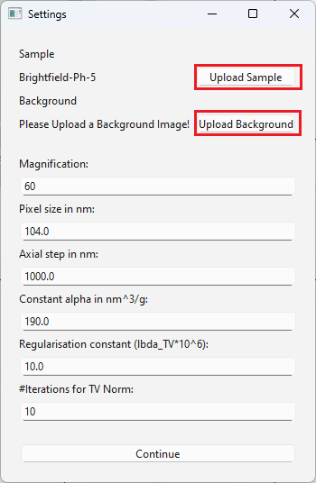

.. _ref_settings:

Settings
=========

The following section describes the settings window, which automatically opens after a file is uploaded successfully.

*********************************************************************************************************************

The ``Settings`` window is the first step in the calculation process. It allows you to set the parameters for:

- the calculation of the cell dry mass 
- the settings used during the image aquisition.

Although the window opens automatically after a successful file upload, it can also be opened manually by clicking the ``Settings`` button 
in the toolbar.

To perform calculations, two images are required: a background image and a sample image. The background image is used to remove the light 
characteristics from the sample image.
This step is essential, as it reduces artifacts in the phase reconstruction. Without it, the calculation will not produce correct results.

*******************************************************************************************************************

There is a slight difference in the upload process depending on the file type. (The workflow is the same for ``.tif`` and ``.stk`` files)
More detailes are provided in section :ref:`ref_settings_lif` and :ref:`ref_settings_tif`.

******************************************************************************************************************

he first step is to configure the parameters for the calculation. These parameters are the same for all supported file types
and must all be filled out:

- **Magnification** is the microscope magnification used during image aquisition

- **Pixel size** refers to the physical size of each individual pixel in the camera sensor (in nanometer)

- **Axial Step** is the distance moved by the microscope stage or the focal plane along the z-axis between each image 
  in the z-stack (in nanometer)

- **Constant** :math:`\alpha` is a tabulated constant for different proteins that is used in the calculation of their mass based on 
  changes in the refractive index (in ml/g)

- **Regularisation Constant** :math:`\lambda`  is the penalty factor in the TV-regularisation and controls the influence of the penalty
  function on the phase reconstruction (Too high :math:`\lambda` values result in falsification regarding the cell mass. Therefore, it should 
  be chosen as small as possible). The input is by a factor of :math:`10^6` bigger than the value used for calculations.

- **Number of Iterations for TV-Norm** is the number used for the TV-regularisation method. A low number of iterations results 
  in a bad phase reconstruction. A high number of iterations does not change the dry mass but results in a time-consuming calculation.  

After setting all the parameters and choosing the files like explained in section :ref:`ref_settings_lif` and section :ref:`ref_settings_tif`, 
the button ``Continue`` can be clicked for the next steps in the calculation process.

.. _ref_settings_lif:

Settings - ``.lif`` Files
~~~~~~~~~~~~~~~~~~~~~~~~~~~~

When using a ``.lif`` file, the background and sample images must be saved in the same file. It is possible that the file contains
multiple measurements. The selection is done via the drop-down menu by clicking on the ``v`` sign next to the file name. 
The sample and background image must be selected according to their respective field names. Otherwise a negative mass will be calculated.

.. list-table::
    :widths: 50 50
    :align: center
    :header-rows: 0

    * - .. image:: _img/settings_lif_selection.png
      - .. image:: _img/settings_lif_drop_down.png

.. _ref_settings_tif:

Settings - ``.tif`` / ``.stk`` Files
~~~~~~~~~~~~~~~~~~~~~~~~~~~~~~~~~~~~~~
When using a ``tif`` or ``stk`` file, the background and sample images must be provided as two separate files.
When reaching this step, the sample image is already uplaoded, here it is only neccesary to upload the background image additionally.(However, 
the sample file can still be changed here if something went wrong during the upload process). To upload either a sample or background file, 
click the the ``upload sample file`` or ``upload background image`` button. 

.. note:: 
  It is possible to mix the file types, i.e. a ``.tif`` file can be used as a sample image and a ``.stk`` file as a background image.
  

